# Window Subsystem for Linux Guide

Windows Subsystem for Linux (WSL) is a Linux operating system that runs on top of your Windows machine.

Since this is a full Linux environment, it is much easier to set up and use than Cygwin.

# Step by step guide

- Go to [this link](https://docs.microsoft.com/en-us/windows/wsl/install-win10) for the official full documentation.

## 1. Enable WSL 
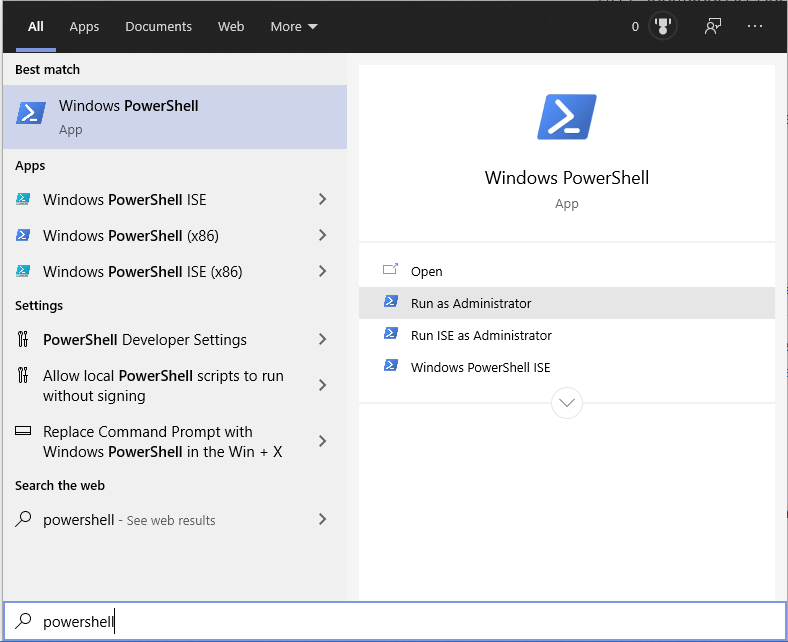

Open powershell in administrative mode. (Hit Windows key, type powershell, and click "Run as Administrator").

Paste the following command and hit enter.

`dism.exe /online /enable-feature /featurename:Microsoft-Windows-Subsystem-Linux /all /norestart`

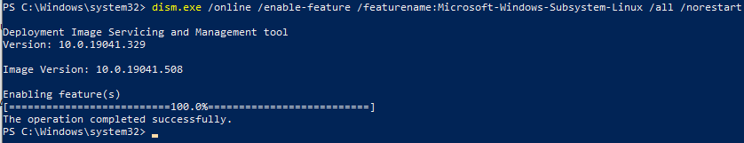

You now enabled WSL on your Windows machine. 

Now restart your computer to apply the changes. 

## 2. Install Linux Distro
After restart, open Microsoft store and search for your favorite choice of Linux distro. 

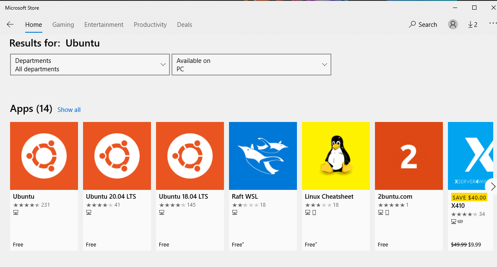

My recommendation is Ubuntu (either 20.04 LTS or 18.04 LTS), which I'll be using it for this guide.

After installing Ubuntu from store, launch it.

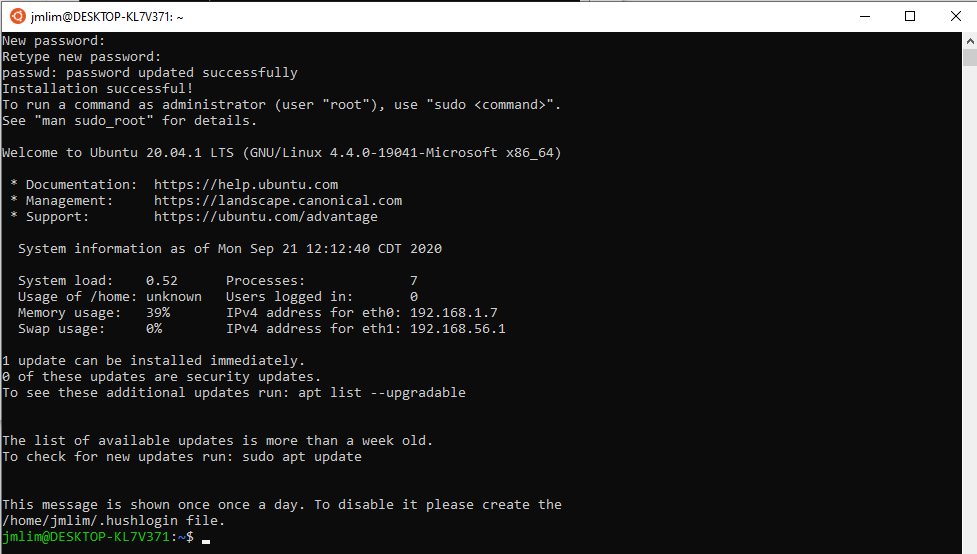

Ubuntu will start installing itself, and once done, it will prompt for username and password. Once done installing, update your system by typing:

`sudo apt update && sudo apt upgrade -y`

(This is similar to what you did in your ec2 instant with yum.)

Then, type `explorer.exe .` to open  the home directory of Ubuntu in the Windows file explorer. 

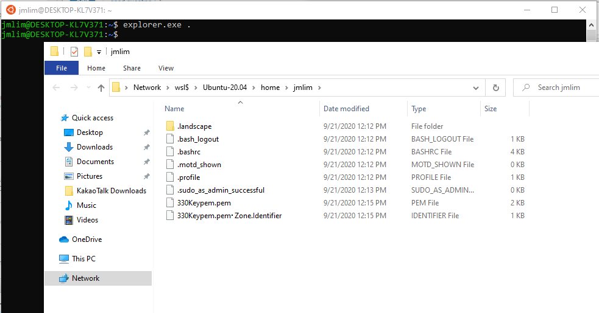

Move the `.pem` file you downloaded from AWS when you created your instance. 

Now go back to Ubuntu terminal and type 

`ssh -i your_key_name.pem ec2-user@ec2-blah-blah.aws.com`

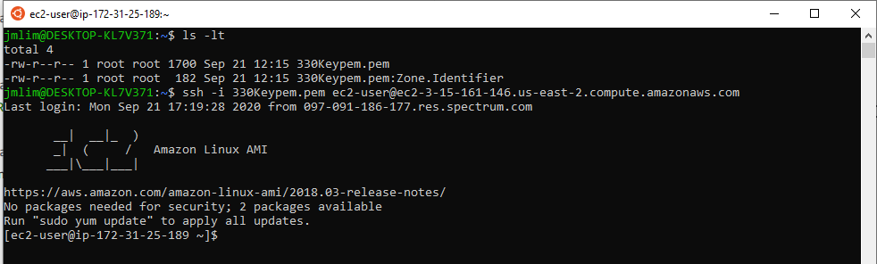

You should be able to log into your account. 

If you see some permission related error messages, try the following commands and try again. 

`sudo chmod <your_ubuntu_username> <your_key.pem>`

`sudo chown 600 <your_key.pem>` 

## Creating your own key pair 

This step is  very similar to what is on the course wiki. 

Type `ssh-keygen` to generate your own key pair.

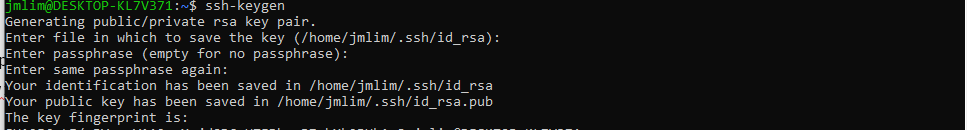

Now when you look at your `~/.ssh` folder, you will see both your public key (`id_rsa.pub`) and private key (`id_rsa`). 

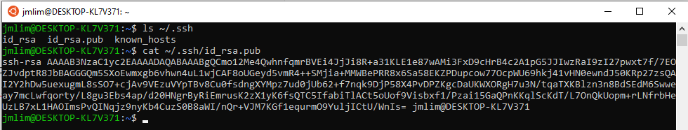

Now follow the steps in the wiki to create a new user and register your public key under `/home/new_user/.ssh/authorized_keys`. 

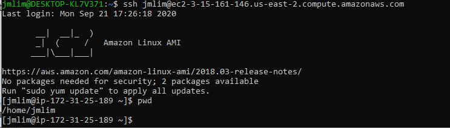

After that, you should be able to log into your ec2 instance as your new user using your ssh key pair. 

## Bonus: SFTP plugin 

Now that you have your new key pair and ssh working, you might want to use the same key for your VScode SFTP plugin. 

However, your WSL home folder is under some funky network directory (`\\wsl$\Ubuntu-20.04\home\jmlim` for me), so you probably don't want to use that path in your `SFTP.json` file. 

Instead, you can create a new key pair just for your SFTP plugin. 

1. Create a new key  pair 

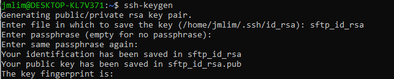 

Note that this time **you should specify a name.** If you hit enter, then ssh-keygen will  by default **overwrite your existing key and you will have to register your ssh key again on ec2!**

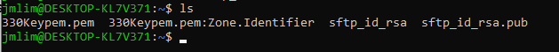

You will see your new key pair under your Ubuntu home.  

2. Put the private key somewhere in your C drive. 

I will put it under my home directory: `C:/Users/jmlim/.ssh` 

3. Register the new public key in your ec2's authorized_keys

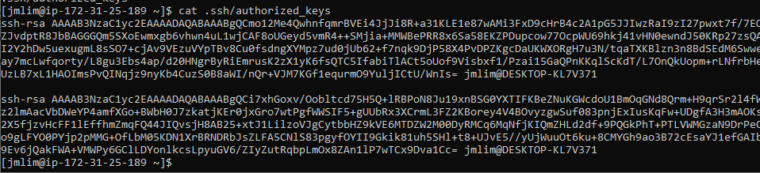

First line is my `id_rsa.pub`, and second is my `sftp_id_rsa.pub`. 

4. Update your SFTP.json file 

For me it would be something like: 

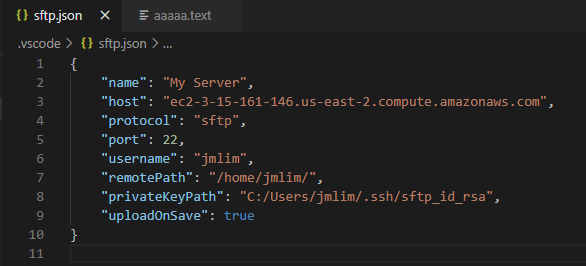

Note that your user must have write permission to the directory at `remotePath`. 

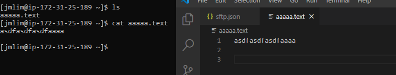

SFTP Plugin can now ship your files on save.  
